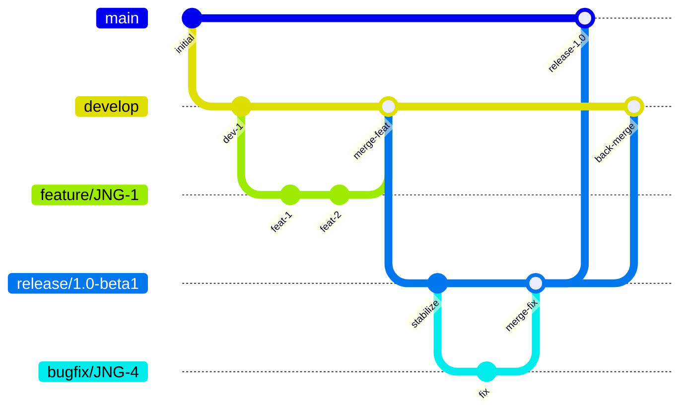
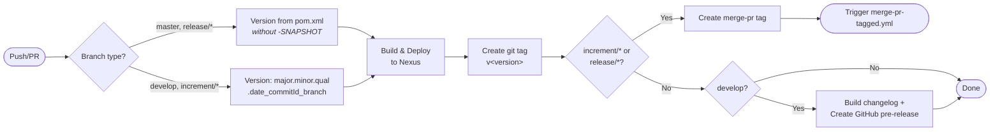
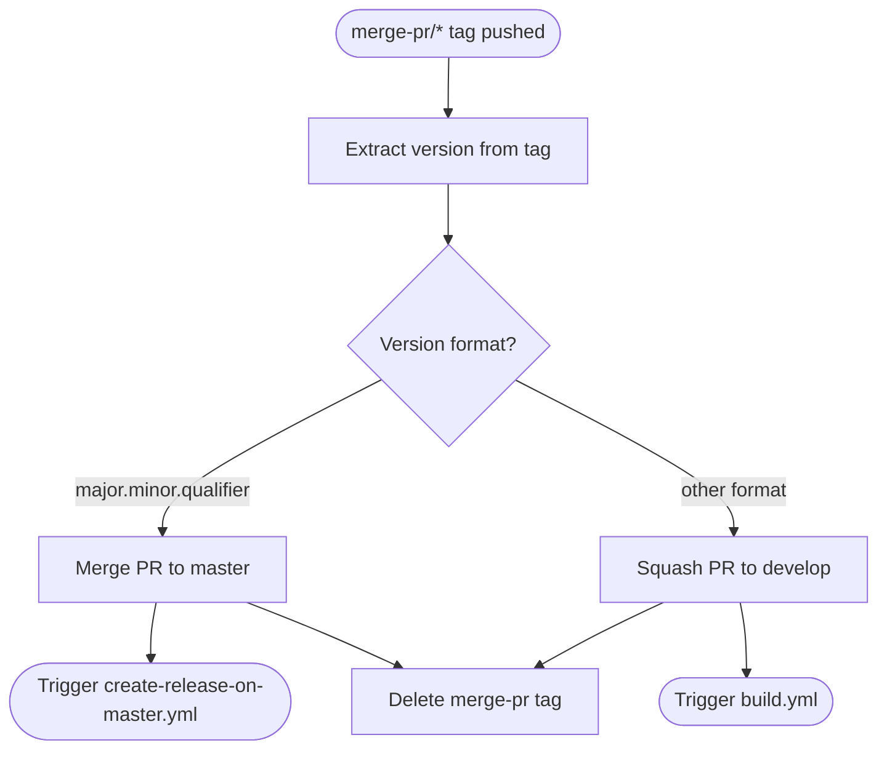
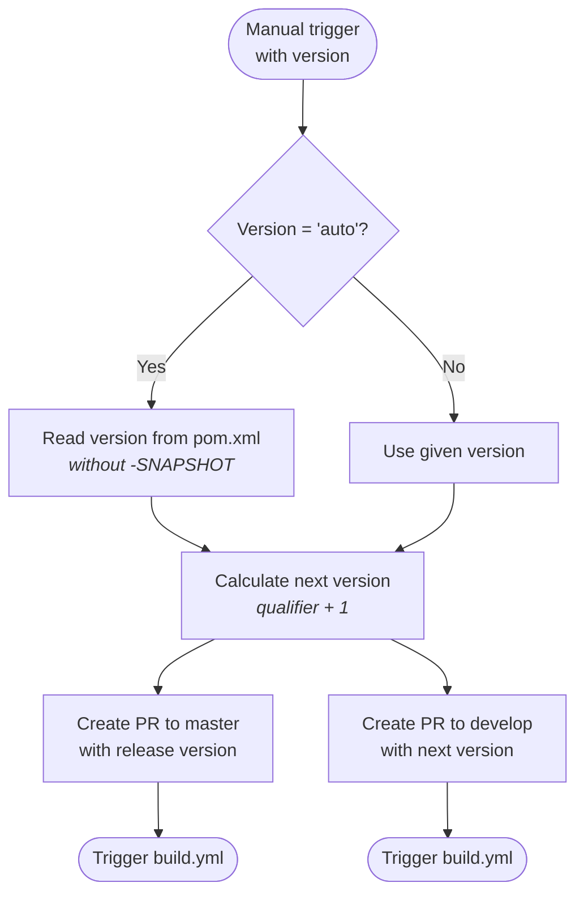

# Development Versioning and Branch Handling

This document describes the branching strategy, version numbering, and CI/CD pipeline for the Mapper project.

## Branch Strategy

The project follows a GitFlow-based workflow. Each branch type serves a specific purpose in the development lifecycle:

| Branch Pattern | Purpose | Based On | Merges Into |
|---------------|---------|----------|-------------|
| `develop` | Latest development sources of the active version | — | — |
| `feature/JNG-xxx_summary` | New feature development | `develop` | `develop` |
| `release/X.Y-betaN` or `X_Y_betaN` | Release stabilization and testing | `develop` | `master` + `develop` |
| `bugfix/JNG-xxx_summary` | Fixes discovered during release testing | release branch | release branch + `develop` |
| `support/JNG-xxx_summary` | Minor changes for a previous release | release branch | release branch |
| `hotfix/JNG-xxx_summary` | Urgent fixes for production | `master` | `master` + `develop` |
| `master` | Latest released sources | — | — |

### Branch Flow

## Version Numbers

Version numbers follow semantic versioning with these rules:

| Event | Version Change | Example |
|-------|---------------|---------|
| Start a `feature/` branch | No change | stays `1.1.0-SNAPSHOT` |
| Start a `release/` branch | 2nd number incremented on `develop` | `develop` becomes `1.2.0-SNAPSHOT` |
| Start a `bugfix/` branch | No change | inherits release version |
| Start a `support/` branch | 3rd number incremented | `1.0.1-SNAPSHOT` |
| Start a `hotfix/` branch | 4th number incremented | `1.0.0.1-SNAPSHOT` |

## CI/CD Pipeline

### build.yml — Main Build Workflow

This is the primary CI pipeline, triggered on pushes to `develop` and pull requests to `develop`, `master`, `increment/*`, and `release/*` branches.

**Build environment:**
- JDK 21 (Zulu distribution)
- Runs on: `judong` (custom runner)
- Timeout: 30 minutes
- Dependabot PRs are skipped

### merge-pr-tagged.yml — PR Merge Handler

Triggered when a `merge-pr/*` tag is pushed. Routes the merge based on the version format:

### create-release-on-master.yml — Release Publisher

Triggered on pushes to `master`. Generates a changelog and creates a GitHub release (marked as latest).

### release.yml — Release Initiator

Manually triggered with a version parameter (`auto` or `major.minor.qualifier`):

## Development Rules

> **Important:** Every commit must reference a JIRA ticket number. The format is `JNG-xxx` in the commit message. There is no commit without a ticket number.

Issue tracking is managed in [JIRA](https://blackbelt.atlassian.net/jira/dashboards).

## Maven Profiles

The build uses several Maven profiles for different deployment targets:

| Profile | Purpose | When Used |
|---------|---------|-----------|
| `modules` | Activates all submodules (default) | Always, unless `-DskipModules=true` |
| `sign-artifacts` | GPG-signs artifacts | Release builds |
| `release-judong` | Deploys to JudoNG Nexus | CI pipeline (Judo internal) |
| `release-central` | Deploys to Maven Central via OSSRH | Public releases |
| `generate-github-asciidoc-diagrams` | Renders AsciiDoc diagrams to PNG | Documentation generation |
| `update-source-code-license` | Updates Apache 2.0 license headers in source files | On demand |
