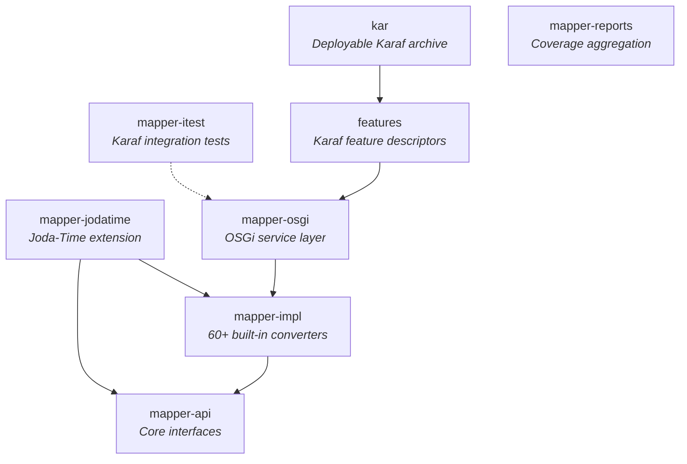

# Contributing to Mapper

## Development Environment Setup

### Required Software

| Tool | Version | Notes |
|------|---------|-------|
| JDK | 21 | The project targets Java 21 (configured in `pom.xml`). Any distribution works (Zulu, Temurin, etc.) |
| Maven | 3.9.4+ | A Maven wrapper (`./mvnw`) is included — you don't need a system-wide install |

### Verifying Your Setup

Check Java:
```sh
java -version
# Should show version 21.x
```

Check Maven (or just use the wrapper):
```sh
./mvnw -version
```

JVM options for the build are pre-configured in `.mvn/jvm.config` (1 GB min heap, 2 GB max heap, UTF-8 encoding).

## Project Structure

The project is a multi-module Maven build. Each module has a focused responsibility:



## Build Commands

```sh
# Full build with tests
./mvnw clean install

# Tests only
./mvnw clean test

# Skip tests
./mvnw clean install -DskipTests

# Single module
./mvnw test -pl mapper-impl
```

## Submitting an Issue

Before filing, please search the [issue tracker](https://github.com/BlackBeltTechnology/mapper/issues) — your problem may already be reported or resolved.

When filing a bug report, include:

- Output of `java -version` and `mvn -version`
- The relevant `pom.xml` or `.flattened-pom.xml` (if applicable)
- A minimal reproduction case that demonstrates the failure

A minimal reproduction helps maintainers confirm and fix the bug quickly. We will ask for one if it's not provided.

File new issues using the [issue form](https://github.com/BlackBeltTechnology/mapper/issues/new/choose).

## Submitting a Pull Request

This project follows [GitHub's standard forking model](https://guides.github.com/activities/forking/). Fork the repository and submit pull requests from your fork.

For details about the CI/CD pipeline and branch management, see the [CI Flow documentation](.github/CIFLOW.md).
