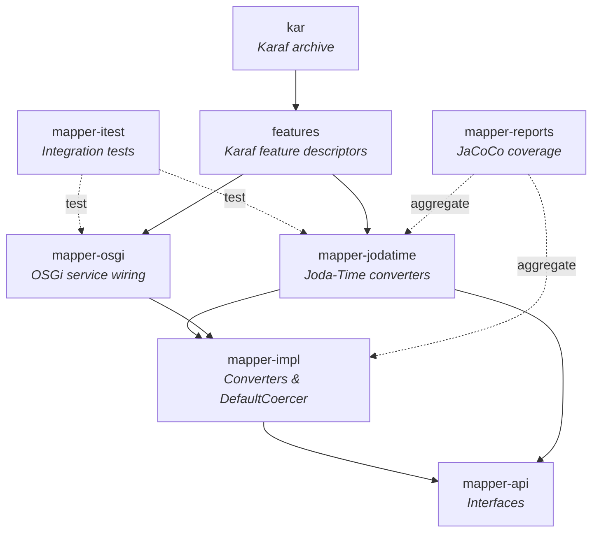
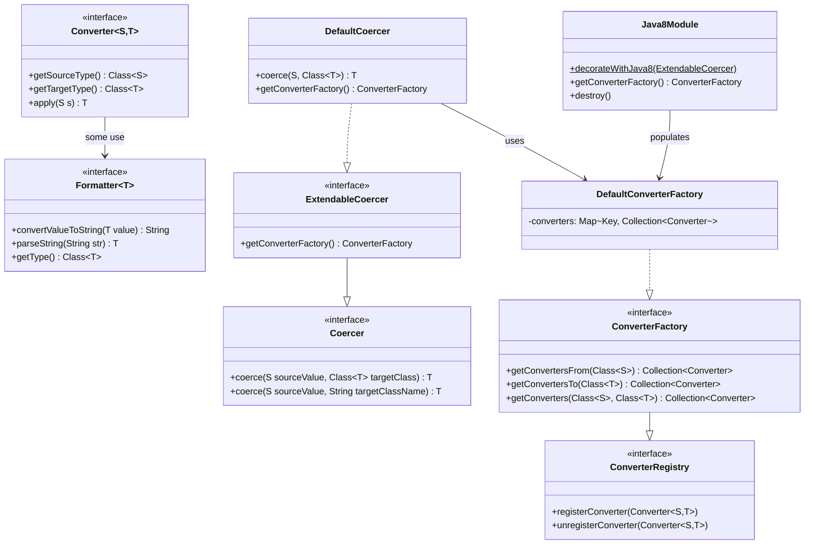
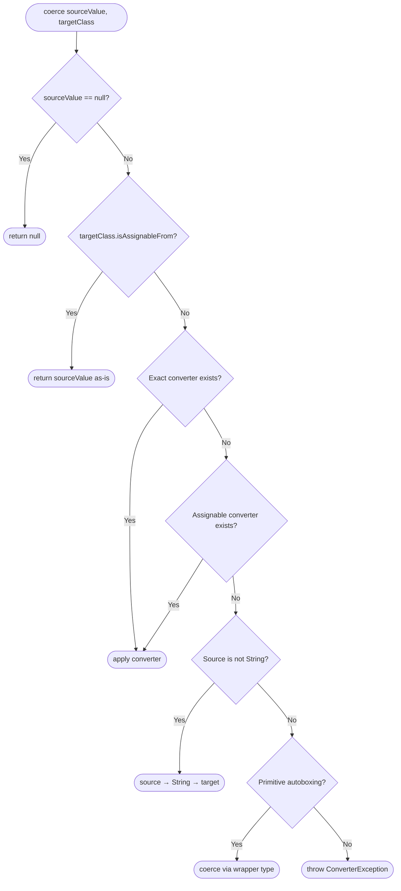
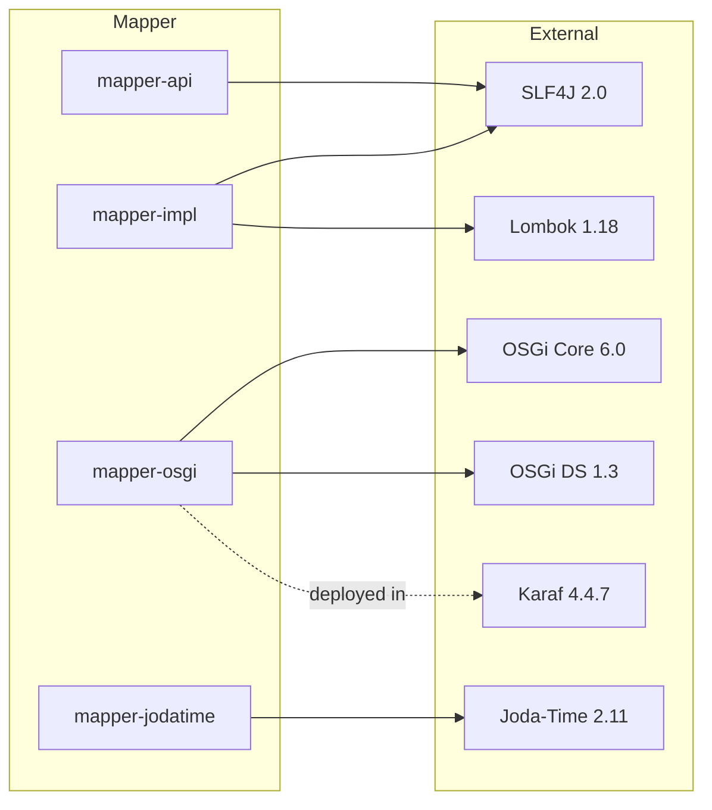

# Mapper

[](https://github.com/BlackBeltTechnology/mapper/actions/workflows/build.yml)

## Introduction

Mapper is a Java type coercion library by [BlackBelt Technology](https://www.blackbelt.hu) that generalizes conversion between data types. It provides a pluggable `Converter<S,T>` system with 60+ built-in converters covering numeric, temporal, boolean, UUID, and string types. The library supports both standalone Java usage and OSGi deployment via Apache Karaf.

The core idea is simple: call `coercer.coerce(value, TargetType.class)` and the library finds and applies the right converter chain automatically, including a two-step fallback through `String` when no direct converter exists.

## Architecture

### Module Dependency Graph



### Class Diagram — Core API



### Coercion Flow

The `DefaultCoercer.coerce()` method follows a multi-step resolution strategy:



### Built-in Converter Categories

The library ships with converters organized by domain:

| Package | Category | Examples |
|---------|----------|----------|
| `numeric/` | Number parsing | String to Integer, Long, BigDecimal, Double, Float, Short, Byte, BigInteger |
| `temporal/` | Date/time conversion | Between LocalDateTime, ZonedDateTime, OffsetDateTime, SqlTimestamp, SqlDate, SqlTime, LocalDate, LocalTime |
| `string/` | To-string formatting | Date, Calendar, LocalDate/Time, OffsetDateTime, ZonedDateTime, Sql types to String |
| `logical/` | Boolean parsing | String to Boolean |
| `uuid/` | UUID handling | String to UUID |
| `formatters/` | Temporal formatting | ISO formatters for all date/time types |

### Dependency Graph — External Libraries



## Build Commands

The project uses Maven with a wrapper script. Java 21 is required.

```bash
# Full build (compile + test + package)
./mvnw clean install

# Build without tests
./mvnw clean install -DskipTests

# Run all tests
./mvnw clean test

# Run a single test class
./mvnw test -pl mapper-impl -Dtest=DefaultCoercerTest

# Run a single test method
./mvnw test -pl mapper-impl -Dtest=DefaultCoercerTest#testStringToBigDecimalConvert
```

## Contributing to the Project

Everyone is welcome to contribute to Mapper! Please see the [Contributing Guide](CONTRIBUTING.md) for details on how to get started, submit issues, and create pull requests.

## License

This project is licensed under the [Apache License 2.0](http://www.apache.org/licenses/LICENSE-2.0).
